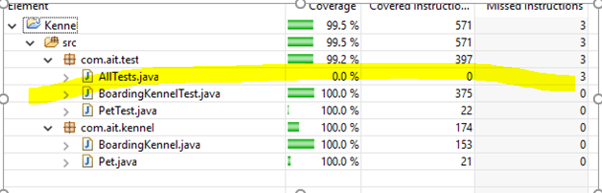

## Unit Testing Boarding Kennel Solution

### Instructions

Time Allowed: 2.5 hrs

Upload to moodle a .zip file of your eclipse project and a word document with the screenshots from the jUnit output and the code coverage – examples below. Make sure that the code you submit compiles. If you break it while adding a test, leave time to revert back to a compiling version.

NB Make sure you upload the correct files. 

**N.B.Name your test methods as specified in this document, otherwise I may not be able to correct your assessment.**

Sample Screenshots


 
 	Code Coverage Screenshot

```
▾ 📄 com.ait.test.AllTests
  ▾ 📄 com.ait.test.BoardingKennelTest
      📄 testSearchByNameNotFound
      📄 testZeroCatsInKennel
      📄 testAddNotCatOrDog
      📄 testVirusInKennel
      📄 testAddOneDogOneCatOK
      📄 testZeroDogsInKennel
      📄 testAddOneCatOK
      📄 testAddOneDogOK
      📄 testAddTwoCatsOK
      📄 testAddTwoDogsOK
      📄 testAddMaxNumCats
      📄 testAddMaxNumDogs
      📄 testSearchByNameFound
     📄 testAddDogNotVaccinated
  ▾ 📄 com.ait.test.PetTest
      📄 testPetConstructor
```
 
	jUnit Output Screenshot (all tests implemented)

Notes on Marking Scheme

1.	Your production code and your test code must compile.
2.	A test should be passing (green bar) before it will be marked. No marks for partially completed/failing tests or for partially completed code or code with compilation errors. Just because a test is green does not automatically mean it is correct either.
3.	Implement the tests one by one as specified in this document.
4.	Name the tests as specified in the document. Otherwise your submission may not be possible to correct.
5.	Don’t add any methods that are not specified in the UML.

### UML Diagram
 
```
+-------------------------------------------------------------+                       +-----------------------------+
|                       + BoardingKennel                      |                       |            + Pet            |
+-------------------------------------------------------------+                       +-----------------------------+
| -maxNumCats : Integer                                       |                       | -petType : String           |
| -maxNumDogs : Integer                                       |                       | -vacinationStatus : Boolean |
| -virusInKennelStatus : Boolean                              |                       | -petName : String           |
+-------------------------------------------------------------+  1   contains   0..*  +-----------------------------+
| +getCurrentNumCats() : Integer                              |---------------------->|                             |
| +getCurrentNumDogs() : Integer                              |                       +-----------------------------+
| +checkInPet(pet : Pet) : String                             |         ____________________________________________
| +findPetByName(petName : String) : ArrayList<Pet>           |        | getters for all attributes in Pet          |
| +setVirusInKennelStatus(virusInKennelStatus:Boolean) : void |        | constructor that initialises all variables |
+-------------------------------------------------------------+        |____________________________________________|
```

	Figure 1

The Boarding Kennel can accept pets of type “cat” or “dog”. The kennel has a limit for the maximum number of cats and the maximum number of dogs that it can accept.

To be accepted into the kennel, the pet must have a vacinationStatus of true.

Sometimes there is an outbreak of a virus in the kennel in which case no pets can be checked in. 

There is a constructor for BoardingKennel that does not take any arguments, but instantiates an ArrayList of type Pet, sets maxNumCats to 3, maxNumDogs to 2, and virusInKennelStatus to false.

**Notes on methods:**

> checkInPet returns a String.  
>  
> “OK” is the pet was successfully checked in,  
> “NOT VACINATED” if the pet vacinationStatus is false.  
> “MAXNUMDOGS” if the pet is a dog and the maxNumDogs (2) has already been reached  
> “MAXNUMCATS” if the pet is a cat and the maxNumCats (3) has already been reached  
> “NOT A CAT OR DOG” if the type of pet is not a cat or a dog.  
> “KENNEL CLOSED” if virusInKennelStatus is true  

The Boarding Kennel will implement the following User Stories
1.	As staff member I want to be able to check the how many dogs are in the kennel so that I know how much dog food to order.
2.	As staff member I want to be able to check the how many cats are in the kennel so that I know how much cat food to order.
3.	As a staff member I want to be able to checkIn a pet so that all pets in the kennel are accounted for.
4.	As a staff member I want to be able to search by pet name so that I can easily locate pets with a particular name.

---

1.	Starting the project – Create a separate package for your test code.
2.	Make a package called com.ait.kennel and a package called com.ait.test.

 ```
▾ 📁 Kennel
  ▾ 📂 src
    ▾ 📦 com.ait.kennel
      > 📄 BoardingKennel.java
      > 📄 Pet.java
  ▾ 📂 test
    ▾ 📦 com.ait.kennel
      > 📄 PetTest.java
```

    Figure 2

First write a unit test class PetTest that tests the constructor of the Pet class. The tests should be called testPetConstructor (given below). 

```java title="testPetConstructor()"
@Test
public void testPetConstructor() {
    Pet pet = new Pet("dog", true, "Rex");
    assertEquals("dog", pet.getPetType());
    assertTrue(pet.isVacinationStatus());
    assertEquals("Rex",pet.getPetName());
}
```

Now we will test the BoardingKennel functionality, user story by user story. 

### User Story 1

As staff member I want to be able to check the how many dogs are in the kennel so that I know how much dog food to order.

**Test 1-1** Call this test `testZeroDogsInKennel`. When the boarding kennel is created initially it should contain zero dogs. Create an instance of `BoardingKennel` and check that `getCurrentNumDogs` returns zero.

```java title="testZeroDogsInKennel()"
@Test
public void testZeroDogsInKennel() {
    assertEquals(0, boardingKennel.getCurrentNumDogs());
}
```

**Note**: We will test for numbers other than zero after we implement the “checkIn Pet” functionality later. Only check for zero now.

### User Story 2

As staff member I want to be able to check the how many cats are in the kennel so that I know how much cat food to order.

**Test 2-1** – Call this test `testZeroCatsInKennel`. When the boarding kennel is created initially it should contain zero cats. Create an instance of `BoardingKennel` and check that `getCurrentNumCats` returns zero.

**Note**: We will test for numbers other than zero after we implement the “checkIn Pet” functionality later. Only check for zero now.

### User Story 3

As a staff member I want to be able to checkIn a pet so that all pets in the kennel are accounted for.

**Test 3-1** Check in a pet of type cat with method `checkInPet` and assert that the String “OK” is returned. Also check that there is now one cat in the kennel using `getCurrentNumCats`. Call this test `testAddOneCatOK`.

**Test 3-2** Check in two pets of type cat with method `checkInPet` and assert that the String “OK” is returned in both cases. Also check that there are now two cats in the kennel using `getCurrentNumCats`. Call this test `testAddTwoCatsOK`.

**Test 3-3** Check in a pet of type dog with method `checkInPet` and assert that the String “OK” is returned. Also check that there is now one dog in the kennel using `getCurrentNumDogs`. Call this test `testAddOneDogOK`.

**Test 3-4** Check in two pets of type dog with method `checkInPet` and assert that the String “OK” is returned in both cases. Also check that there are now two dogs in the kennel using `getCurrentNumDogs`. Call this test `testAddTwoDogsOK`.

**Test 3-5** Check in one pet of type dog with method `checkInPet` and one pet of type dog and assert that the String “OK” is returned for both cases. Also check that there is now one dog in the kennel using `getCurrentNumDogs` and one cat in the kennel using `getCurrentNumCats`. Call this test `testAddOneDogOneCatOK`.

**Test 3-6** Attempt to check in a pet of type dog whose vacinationStatus has been set to false (in pet constructor) and assert that the String “NOT VACINATED” is returned. Also check now that there are zero dogs in the kennel using `getCurrentNumDogs`. Call this test `testAddDogNotVacinated`.

**Test 3-7** Check in two pets of type dog and attempt to check in a third dog. Assert that the String “MAXNUMDOGS” is returned. Also check that there are only two dogs in the kennel using `getCurrentNumDogs`. Call this test `testAddMaxNumDogs`.

**Test 3-8** Check in three pets of type cat and attempt to check in a forth cat. Assert that the String “MAXNUMCATS” is returned. Also check that there are only three cats in the kennel using `getCurrentNumCats`. Call this test `testAddMaxNumCats`.

**Test 3-9** Attempt to check in a pet of type “snake”. Assert that the String “NOT A CAT OR DOG” is returned. Call this test `testAddNotCatOrDog`.

**Test 3-10** Attempt to check in a pet when there is a virus in the kennel. Use the method `setVirusInKennelStatus` to set virusInKennelStatus to true. Attempt to check in a pet of type cat and assert that the String “KENNEL CLOSED” is received. Also assert that the number of cats in the kennel is zero using `getCurrentNumCats`. Call this test `testVirusInKennel`

### User Story 4

As a staff member I want to be able to search by pet name so that I can easily locate pets with a particular name. Pet name is not unique so there may be more than one pet with the specified name.

**Test 4-1** Call this test `testSearchByNameFound`. Check In a cat called “Alex” to the kennel. Use the method `findPetByName` and check that an ArrayList of size one is returned. Assert that the name of the Pet object in the ArrayList is “Alex”.

**Test 4-2** Call this test `testSearchByNameNotFound`. Check In a cat called “Alex” to the kennel. Use the method `findPetByName` to search for name AlexOne and check that an ArrayList of size zero is returned.

**Test 4-2** Call this test `testSearchByNameTwoFound`. Check In a cat called “Alex” and a dog called “Alex” to the kennel. Use the method `findPetByName` and check that an ArrayList of size two is returned. Assert that the name of the Pet objects in the ArrayList are “Alex”.

---

[BoardingKennel.java](https://github.com/joeaoregan/AIT-CSE-SoftwareDesignAndTesting/blob/master/src/ait/sdt/wk7/BoardingKennel.java)  
[Pet.java](https://github.com/joeaoregan/AIT-CSE-SoftwareDesignAndTesting/blob/master/src/ait/sdt/wk7/Pet.java)  
[PetTest.java](https://github.com/joeaoregan/AIT-CSE-SoftwareDesignAndTesting/blob/master/Test/ait/sdt/wk7/PetTest.java)