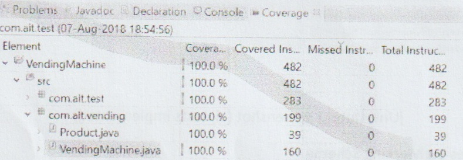
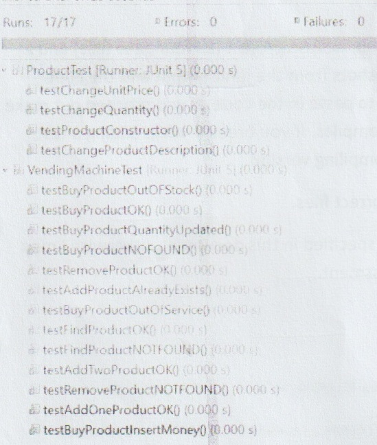
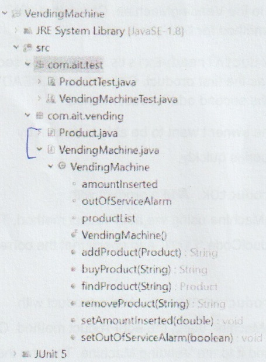

## Unit Testing Vending Machine

### Instructions

**Time Allowed:** 2.5 hrs

Upload to moodle a .zip file of your eclipse project (all four .java files) and a word document with the screenshots from the **junit output** and the **code coverage only**. You do not need to paste in the code as you proceed but make sure that the code you submit compiles. If you break it while adding a test, leave time to revert back to a compiling version.

**NB** Make sure you upload the correct files.

**N.B.** Name your test methods as specified in this document, otherwise I may not be able to correct your assessment.

### Sample Screenshots



**Code Coverage Screenshot**

---



**jUnit Output Screenshot (all tests implemented)**

### Notes on Marking Scheme

1. **Your production code and your test code must compile.**
2. **You test should be passing (green bar) before it will be marked. No marks for partially completed/failing tests or for partially completed code or code with compilation errors. Just because a test is green does not automatically mean it is correct.**
3. **Implement the tests one by one as specified in this document.**
4. **Name the tests as specified in the document.**

---

### UML Diagram

```
+--------------------------------------------------------+
|                    + VendingMachine                    |
+--------------------------------------------------------+
| -amountInserted : double                               |
| -outOfServiceAlarm : Boolean                           |
+--------------------------------------------------------+  1       0..* +-------------------------------------------------------------------------------------------------+
| +addProduct(product : Product) : String                |--------+----->|                                      + Product                                                  |
| +removeProduct(productCode : String) : String          |               +-------------------------------------------------------------------------------------------------+
| +findProduct(productCode : String) : Product           |               | -productCode : String                                                                           |
| +setMoneyInserted(amountInserted : double) : void      |               | -productDescription : String                                                                    |
| +setOutOfServiceAlarm(outOfServiceAlarm : Boolean):void|               | -quantity : int                                                                                 |
| +buyProduct(productCode : String) : String             |               | -unitPrice : double                                                                             |
+--------------------------------------------------------+               +-------------------------------------------------------------------------------------------------+
                                                                         | +Product(productCode : String, productDescription : String, quantity : int, unitPrice : double) |
                                                                         +-------------------------------------------------------------------------------------------------+
                                                                          _______________________________________________________________________
                                                                         | getters and setters for all Product attributes except for productCode |
                                                                         | There is a getter for productCode but no setter.                      |
                                                                         |_______________________________________________________________________|

```

**Figure 1**

**Description:** We can add products to the vending machine. We can also remove products from the machine and we can find products by productCode in the machine. Before we buy products we have to insert money (by calling the method setMoneyInserted) of a value greater than or equal to the unitPrice of the product that we want to purchase. It is possible to have an out of service alarm on the machine (set using the setOutOfService method).

There is a constructor for VendingMachine that does **not take any arguments**, but initialises an `ArrayList` of type `Product`. `amountInserted` is initialised to 0 and outOfServiceAlarm equal to false.

### Notes on methods:

> **addProduct** accepts a product object ref. and returns a String.  
> "OK" is returned if the product was added successfully,  
> "ALREADY EXISTS" is returned if you try to add a product when a product with the same productCode already exists. The productCode for the product must be unique.  

---

> **findProduct** accepts a productCode (String) returns a Product object reference. If a product with the productCode does not exist, then the object reference returned will be null.  

---

> **removeProduct** accepts a productCode (String) and returns a String.  
> "OK" is returned if the product was removed successfully.   
> "NOT FOUND" is returned if a product with that productCode does not exist in the Vending Machine  

---

> **buyProduct** accepts a productCode (String) and returns a String.  
> ✓ "OK" is returned if it was possible to buy a product successfully.  
> To buy a product, a product with that productCode must be in the Product list (ArrayList), outOfServiceAlarm must be false, and amountInserted must be greater than or equal to the   unitPrice of the product the customer is purchasing.  
> ✓ "OUT OF SERVICE" is returned if outOfServiceAlarm is true (set with setOutOfServiceAlarm method)  
> ✓ "NOT FOUND" is returned if the productCode is not found.  
> "INSERT MONEY" is returned if the unitPrice of the product is greater than the amountInserted (set with setAmountInserted method before calling buyProduct).  
> "OUT OF STOCK" is returned if a product with that productCode exists but its quantity value is zero.  

The Vending Machine will implement the following User Stories

1. As a vending machine owner I want to be able to add products to the Machine so that I can stock new products for my customers.
2. As a vending machine owner I want to be able to search by productCode so that I can answer queries quickly.
3. As a vending machine owner I want to be able to remove products from the machine so that I can remove products that become unpopular.
4. As a customer I want the buy products from the vending machine so that I can purchase a snack when the canteen is closed.

---

First write a unit test class `ProductTest` that tests the constructor and the getters and setters of the Product class. The tests should be called `testProductConstructor` (given below), `testChangeUnitPrice`, `testChangeProductDescription`, and `testChangeQuantity`.

```java
    @BeforeEach
    void setUp() {
        product = new Product("D001", "Mars Bar", 1.49, 5);
    }

```

```java
    @Test
    void testProductConstructor() {
        assertEquals("D001", product.getProductCode());
        assertEquals("Mars Bar", product.getProductDescription());
        assertEquals(1.49, product.getUnitPrice());
        assertEquals(5, product.getQuantity());
    }

```

1. Starting the project – Create a separate package for your test code.
2. Make a package called `com.ait.vending` and a package called `com.ait.test`.



**Figure 2**

---

Now we will test the VendingMachine functionality, user story by user story.

#### User Story 1

As a vending machine owner I want to be able to add products to the Machine so that I can stock new products for my customers

Test 1-1 – Call this test `testAddOneProductOK`. Add a product to the VendingMachine. Check that the String "OK" is returned.

```java
    @BeforeEach
    public void setUp() {
        product = new Product("D001", "Mars Bar", 1.29, 5);
        vendingMachine = new VendingMachine();
    }

```

```java
    @Test
    void testAddOneProductOK() {
        assertEquals("OK", vendingMachine.addProduct(product));
    }

```

Test 1-2 – Call this test `testAddTwoProductsOK`. Add two products (each product should have a unique productCode) to the VendingMachine. Check that "OK" is returned in response to addProduct method for both products.

Test 1-3 – Call this test `testAddProductAlreadyExists`. Try to add a second product with the same productCode as the first product. Check that "ALREADY EXISTS" is returned in response to the second addProduct method.

#### User Story 2

As a vending machine owner I want to be able to search by productCode so that I can answer queries quickly.

Test 2-1 – Call this test `testFindProductOK`. Add a product with productCode="D001" to the VendingMachine using the addProduct method. The use the findProduct method with the productCode "D001" and check that the correct product object reference is returned.

Test 2-2 – Call this test `testFindProductNOTFOUND`. Add a product with productCode="D001" to the VendingMachine using the addProduct method. Create a product with code "D002" but don't add it to the Vending Machine. The use the findProduct method with the productCode "D002" and check that the product object reference null is returned.

---

```java
    @Test
    void testFindProductNOTFOUND() {
        vendingMachine.addProduct(product);
        Product product1 = new Product("D002", "Dairy Milk", 1.20, 20);
        assertEquals(null, vendingMachine.findProduct("D002"));
    }

```

#### User Story 3

As a vending machine owner I want to be able to remove products from the machine so that I can remove products that become unpopular

Test 3-1 Call this test `testRemoveProductOK`. Add a product to the machine with productCode "D001". Then call removeProduct using productCode "D001" and check that "OK" is returned.

Test 3-1 Call this test `testRemoveProductNOTFOUND`. Add a product to the machine with productCode "D001". Then call removeProduct using productCode "D002" and check that "NOT FOUND" is returned.

#### User Story 4

As a customer I want the buy products from the vending machine so that I can purchase a snack when the canteen is closed.

Test 4-1 Call this test `testBuyProductOK`. Add a product with productCode "D001" to the machine using the addProduct method. Use the method setAmountInserted to a value greater than the unitPrice for product with productCode "D001". Check that the String OK is returned in response to buyProduct with code "D001".

```java
    @Test
    void testBuyProductOK() {
        vendingMachine.addProduct(product);
        vendingMachine.setAmountInserted(2.00);
        assertEquals("OK", vendingMachine.buyProduct("D001"));
    }

```

Test 4-2 Call this test `testBuyProductNOTFOUND`. Add a product with productCode "D001" to the machine using the addProduct method. Check that the String "NOT FOUND" is returned in response to buyProduct with code "D002".

Test 4-3 Call this test `testBuyProductQuantityUpdated`. Add a product with productCode "D001" to the machine using the addProduct method. Use the

---

method `setAmountInserted` to a value greater than the unitPrice for product with productCode "D001". Check that the String OK is returned in response to buyProduct with code "D001". Check that the value of quantity for that product has been decremented (check with getQuantity).

```java
    @Test
    void testBuyProductQuantityUpdated() {
        vendingMachine.addProduct(product);
        vendingMachine.setAmountInserted(2.00);
        assertEquals("OK", vendingMachine.buyProduct("D001"));
        assertEquals(4, product.getQuantity());
    }

```

Test 4-4 Call this test `testBuyProductInsertMoney`. Add a product with productCode "D001" to the machine using the addProduct method. Don't call the method setAmountInserted. Check that the String "INSERT MONEY" is returned in response to buyProduct with code "D001". Check that the quantity value hasn't been decremented (check with getQuantity).

Test 4-5 Call this test `testBuyProductOutOfStock`. Add a product with productCode "D001" to the machine using the addProduct method, with the quantity set to zero for that product. Use the method setAmountInserted to a value greater than the unitPrice for product with productCode "D001". Check that the String "OUT OF STOCK" is returned in response to buyProduct with code "D001".

Test 4-6 Call this test `testBuyProductOutOfService`. Use the method setOutOfService to set outOfServiceAlarm to true. Call the method buyProduct on the VendingMachine and check that "OUT OF SERVICE" is returned.